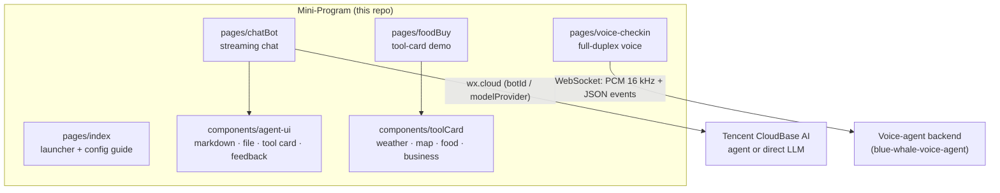
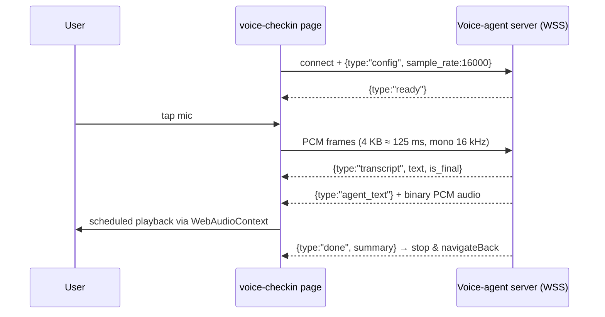

<div align="center">

# wechat-toolkit-miniprogram

**A drop-in WeChat mini-program toolkit: real-time voice check-in, agent chat UI, and reusable tool-card components**

[](https://github.com/JingHao-Leon/wechat-toolkit-miniprogram)
[](https://github.com/JingHao-Leon/wechat-toolkit-miniprogram/commits/main)
[](https://github.com/JingHao-Leon/wechat-toolkit-miniprogram)
[](LICENSE)

</div>

---

A collection of WeChat mini-program pages and components built around a **chatbot + agent UI** core, on the native runtime (WXML / WXSS / JS) with no compile-time framework. Pages and components are source-level and self-contained — copy them into any existing mini-program without touching your `app.js` / `app.json`.

## ✨ Highlights

<table>
<tr>
<td width="50%">

### 🎙️ Real-Time Voice Check-In
`pages/voice-checkin` streams 16 kHz PCM audio over WebSocket to your voice-agent backend, plays the agent's PCM replies through `WebAudioContext`, and renders live transcripts — a full-duplex voice conversation, not a record-and-upload form.

</td>
<td width="50%">

### 💬 Agent Chat UI
`pages/chatBot` + `components/agent-ui` deliver a streaming conversation UI on Tencent CloudBase AI: bot mode (agent `botId`) or direct-model mode (e.g. DeepSeek), with tool-call visualization, web search, file/image upload, and voice input switches.

</td>
</tr>
<tr>
<td width="50%">

### 🧩 Front-End Tools (Sync & Async)
Register JSON-schema tools on the client — the agent calls them and the UI renders the result. Ships with sync (`get_weather`) and async (`get_location`) examples you can copy verbatim.

</td>
<td width="50%">

### 🃏 Tool Cards & Rich Atoms
Ready-made cards — **weather, map, food list, business list** — plus agent-ui atoms: markdown rendering (`wd-markdown`), file attachment, collapse card, custom card, tool call card, and 👍/👎 feedback.

</td>
</tr>
</table>

## 🏗️ Architecture



## 🔄 Voice Check-In Protocol

The voice page speaks a small JSON + binary protocol over one WebSocket — everything below is implemented in `pages/voice-checkin/voice-checkin.js`:



## 🚀 Quick Start

1. **Open in WeChat DevTools** — *Import Project* → select this repo root (`miniprogramRoot` is already set in `project.config.json`; replace the `appid` with your own or use test mode).
2. **Chat page** — edit `miniprogram/pages/chatBot/chatBot.js`:
   - `chatMode: "bot"` → set `agentConfig.botId` to your CloudBase agent ID;
   - `chatMode: "model"` → set `modelConfig.modelProvider` / `quickResponseModel` (e.g. `deepseek` / `deepseek-v3.2`).
3. **Voice page** — edit the `WS_URL` constant at the top of `miniprogram/pages/voice-checkin/voice-checkin.js` to point at your public WSS endpoint (e.g. a Cloudflare tunnel to your voice agent). Nothing else is required — the page is self-contained.
4. **Base library** — AI chat capabilities require base library **≥ 3.7.7**; voice playback requires **≥ 2.19.0** (`wx.createWebAudioContext`).

## 📁 Repository Layout

```
miniprogram/
├── pages/
│   ├── index/            # home / launcher with copy-paste config snippets
│   ├── voice-checkin/    # WebSocket PCM streaming voice check-in (drop-in)
│   ├── chatBot/          # agent / direct-model streaming chat page
│   └── foodBuy/          # demo page wiring food list + option selection
├── components/
│   ├── agent-ui/         # chat atoms: wd-markdown, chatFile, collapse,
│   │                     # customCard, tool card, feedback, tools.js helpers
│   └── toolCard/         # business-list, food-list, map, weather
├── app.json              # pages + global toolCard component registration
└── imgs/
project.config.json       # DevTools project config (miniprogramRoot, appid)
uploadCloudFunction.sh    # one-liner to deploy cloud functions via CLI
```

## ⚙️ Configuration Notes

- **Global tool cards** — `weather`, `map`, `food-list`, `business-list` are registered in `app.json → usingComponents` as `custom-weather`, `custom-map`, `custom-food-list`, `custom-business-list`; use them in any page without re-declaring.
- **Agent capability switches** — `agentConfig` flags (`allowWebSearch`, `allowUploadFile`, `allowUploadImage`, `allowPullRefresh`, `allowMultiConversation`, `allowVoice`, `showToolCallDetail`) toggle UI features per page.
- **Client tools** — add entries to `agentConfig.tools` with `name` / `description` / `parameters` (JSON schema) and a sync or async `handler`; see the two working examples in `chatBot.js`.

## ⚠️ Status & Limitations

- This repo is the **front-end layer only**. The agent backends live in the sibling projects `blue-whale-voice-agent` / `ai-multimodal-platform`; the mini-program is a drop-in client for them.
- The default `WS_URL` points at a temporary Cloudflare tunnel — replace it before any real use.
- `pages/foodBuy` renders static demo data; wire it to your own API for production.

## 📮 Contact

GitHub: [JingHao-Leon](https://github.com/JingHao-Leon)  
Email: 262\*\*\*\*56@qq.com  
Phone: 159\*\*\*\*0000

---

<div align="center">
<sub>
Built on the native WeChat mini-program runtime · Agent UI powered by Tencent CloudBase AI · MIT License
</sub>
</div>
